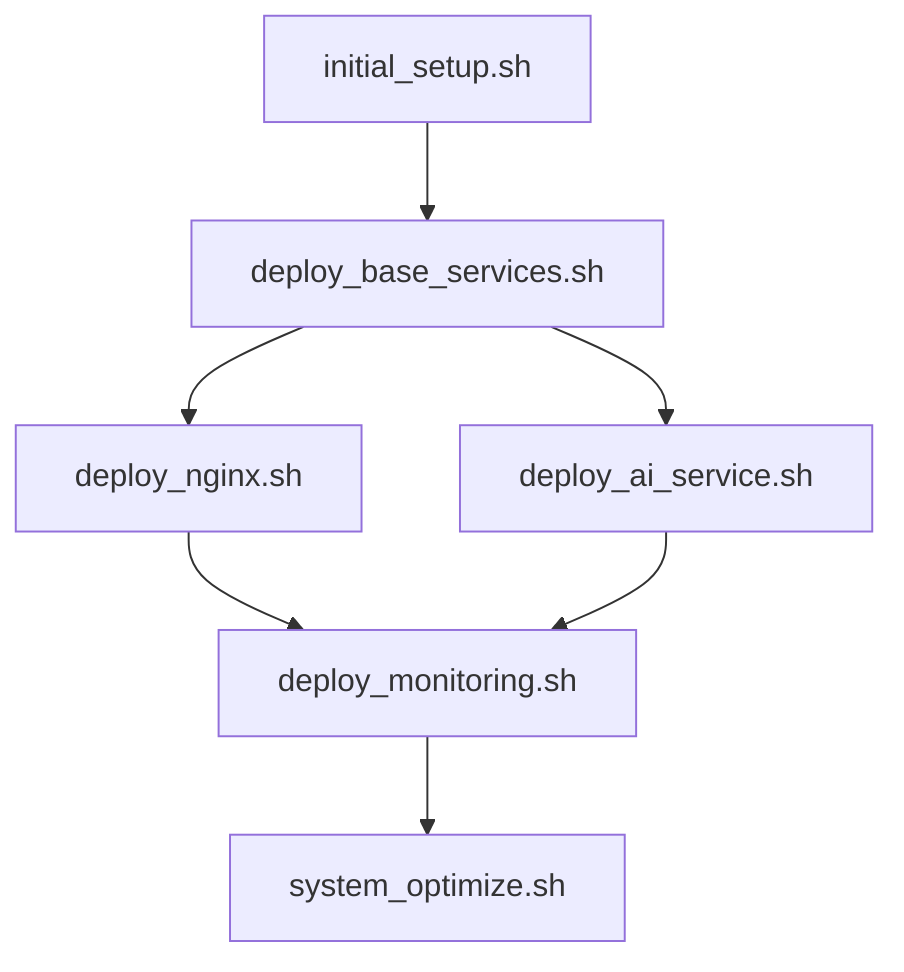

# 树莓派服务部署与维护完整指南使用方案
## 一、初始部署流程
1. **基础环境准备**
```bash
# 1. 克隆所有脚本
git clone https://github.com/yourusername/raspberry-pi-scripts.git
cd raspberry-pi-scripts

# 2. 设置执行权限
chmod +x *.sh

# 3. 初始化系统
./initial_setup.sh
```
2. **服务部署顺序**
```bash
# 1. 部署基础服务
./deploy_base_services.sh

# 2. 部署 Web 服务
./deploy_nginx.sh

# 3. 部署 AI 服务
./deploy_ai_service.sh

# 4. 部署监控系统
./deploy_monitoring.sh
```
## 二、日常维护任务
1. **定时任务配置**
```bash
# 编辑 crontab
crontab -e

# 添加以下任务
# 每天凌晨 2 点执行系统更新
0 2 * * * ~/system_update.sh

# 每 6 小时执行一次健康检查
0 */6 * * * ~/health_check.sh

# 每周日凌晨 3 点执行系统优化
0 3 * * 0 ~/system_optimize.sh

# 每天凌晨 4 点执行备份
0 4 * * * ~/full_backup.sh
```
2. **监控检查**
```bash
# 实时监控系统状态
./monitor_dashboard.sh

# 查看性能报告
cat ~/performance_reports/latest.md
```
## 三、故障处理流程
1. **问题诊断**
```bash
# 运行完整系统检查
./system_check.sh

# 分析日志
./log_analyzer.sh

# 生成诊断报告
cat ~/diagnostic_reports/latest.md
```
2. **恢复流程**
```bash
# 系统故障恢复
./disaster_recovery.sh

# 服务重启
./service_restart.sh
```
## 四、安全维护
1. **定期安全检查**
```bash
# 执行安全审计
./security_audit.sh

# 更新安全配置
./security_update.sh
```
2. **备份管理**
```bash
# 创建完整备份
./full_backup.sh

# 验证备份
./verify_backup.sh
```
## 五、性能优化
1. **系统优化**
```bash
# 执行系统优化
./system_optimize.sh

# 检查优化效果
./benchmark.sh
```
2. **资源监控**
```bash
# 启动资源监控
./resource_monitor.sh

# 查看资源报告
cat ~/resource_reports/latest.md
```
## 六、文档管理
1. **生成文档**
```bash
# 生成系统文档
./generate_docs.sh

# 查看文档
cat ~/documentation/index.md
```

## 七、注意事项
1. **使用前准备**
- 确保所有脚本具有执行权限
- 检查配置文件中的路径是否正确
- 备份重要数据
2. **定期维护**
- 每周检查系统日志
- 每月进行完整备份
- 定期更新系统和软件包
3. **故障预防**
- 保持充足的磁盘空间
- 监控系统负载
- 定期检查服务状态
4. **安全建议**
- 定期更改密码
- 及时应用安全补丁
- 监控异常访问
## 八、脚本依赖关系


## 九、故障排除指南
1. **服务无法启动**
```bash
# 检查服务状态
./service_check.sh

# 查看错误日志
./log_analyzer.sh
```
2. **性能问题**
```bash
# 运行性能诊断
./performance_diagnosis.sh

# 执行优化
./system_optimize.sh
```
3. **存储问题**
```bash
# 清理磁盘空间
./disk_cleanup.sh

# 优化存储
./storage_optimize.sh
```


